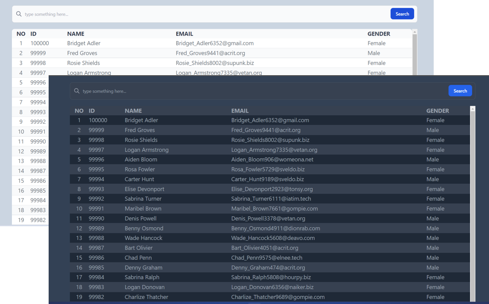

# Infinite Scroll 
This simple project is created for demonstration about fetching 1 milion data super fast with query limit. 
the goal of this project is to create a REST API that can fetch data quickly even if it has a lot of data.
This project use [Express js](https://expressjs.com/) for Backend and [React](https://reactjs.org/) for Frontend and the data stored in database using [MySQL](https://www.mysql.com/). I also use [Tailwind CSS](https://https://tailwindcss.com/) for styling.



## Usage
1. Clone or download this project
```
    git clone  https://github.com/uluumbch/infinite-scroll-app.git
```
2. Go to your download directory
3. open a terminal from this directory
4. set the configuration for backend and frontend. 

## Setup for Backend
1. Go to backend directory for this project
2. Run command to install dependecy
   ```
   npm install
   ```
3. Create a database named `infinite-scroll` in your Mysql database.
4. Run the program for backend server.
   ```
   node index.js
   ```
5. Import `infinite-scroll.sql` to the mysql database.
6. Done! the backend is up and running in http://localhost:5000
   
    >To test the server request run GET request to http://localhost:5000/users

    >to change database name , you can change in config/Database.js

REST API can get some query like below:

  * GET http://localhost:5000/users?limit=10 return data for 10 users
  * GET http://localhost:5000/users?=search_query=john return data containing john in their name or email.
  * you also can join few query. for example GET http://localhost:5000/users?search_query=john&limit25 return 25 users data containing `john`. 


## Setup for Frontend
1. Go to frontend directory for this project
2. Run command to install dependecy
   ```
   npm install
   ```
3. Run the server for frontend
   ```
   npm start
   ```
4. Done! The project up and running in http://localhost:3000/